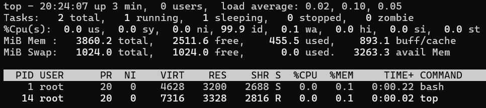
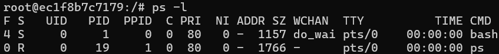
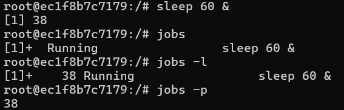
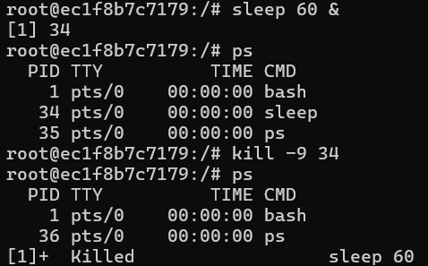

# [과제2] README 파일 작성하기


- **학과** : 컴퓨터공학과
- **학번** : 20203160
- **이름** : 염상헌


---

## 1. top

### ✅ 개념
`top` 명령어는 리눅스 시스템에서 실행 중인 프로세스를 **실시간으로 모니터링**할 수 있는 명령어이다.<br>
CPU 사용률, 메모리 사용량, 프로세스 상태 등을 확인할 수 있어 시스템 상태를 관리할 때 유용하다.<br>
**q**키 또는 **Ctrl + c**를 통해 top명령어를 종료할 수 있다.

### ✅ 사용법
```
top
```


### ✅ 옵션
| 옵션 | 설명 |
|---|---|
| `-d <초>` | 초(s) 단위로 갱신 주기 지정 |
| `-p <pid>` | 특정 pid만 모니터링 |
| `-n <횟수>` | 지정한 횟수만큼만 실행 후 종료 |
| `-u <사용자>` | 특정 사용자 프로세스만 표시 |


### ✅ 예시 / 출력 결과



---

## 2. ps

### ✅ 개념
`ps` 명령어는 현재 **실행중인 프로세스를 확인**할 수 있는 명령어이다.<br>
실행 중인 프로세스의 pid, 사용자 등을 확인할 수 있다.


### ✅ 사용법
```
ps
```


### ✅ 옵션
| 옵션 | 설명 |
|---|---|
| `-l` | 실행 중인 프로세스의 상세판 정보를 보여줌 |
| `-e` | 시스템 전체 프로세스를 보여줌 |
| `-u <사용자>` | 해당 사용자의 모든 프로세스를 보여줌 |


### ✅ 예시 / 출력 결과



---

## 3. jobs

### ✅ 개념
`jobs` 명령어는 현재 **백그라운드에서 실행 중인 프로세스를 확인**할 수 있는 명령어이다.<br>
백그라운드로 실행한 프로세스의 상태나 pid 확인할 수 있다.


### ✅ 사용법
```
jobs
```


### ✅ 옵션
| 옵션 | 설명 |
|---|---|
| `-l` | pid와 상태를 함께 표시 |
| `-p` | pid만 출력 |


### ✅ 예시 / 출력 결과



---

## 4. kill

### ✅ 개념
`kill` 명령어는 **프로세스를 종료**시키는 명령어이다.<br>
명령어 사용 시 반드시 **pid**를 입력해야 하며, 해당 pid에 해당하는 프로세스를 종료시킨다.<br>
따라서, ps 등의 명령어를 통해 종료시킬 프로세스의 pid 확인이 필요하다.


### ✅ 사용법
```
kill <pid>
```


### ✅ 옵션
| 옵션 | 설명 |
|---|---|
| `-9` | 프로세스를 **강제종료** (즉시 종료, 정리 과정 없이 종료함) |
| `-15` | 프로세스를 **정상종료** (안전하게 종료, 프로세스에게 정리 시간을 제공함) |


### ✅ 예시 / 출력 결과



---
