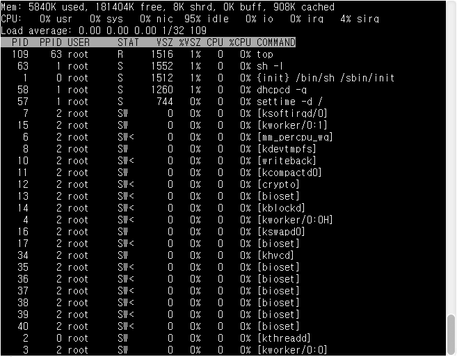

# [과제2] README 파일 작성하기


- **학과** : 컴퓨터공학과
- **학번** : 20203160
- **이름** : 염상헌


---

## 1. top

### ✅ 개념
`top` 명령어는 리눅스 시스템에서 실행 중인 프로세스를 **실시간으로 모니터링**할 수 있는 명령어이다.
CPU 사용률, 메모리 사용량, 프로세스 상태 등을 확인할 수 있어 시스템 상태를 관라힐 때 유용하다.


### ✅ 사용법
```
top
```
- 명령어 실행 시 실시간으로 갱신되는 창이 나타나게 된다.
- **q**키 또는 **Ctrl + c**를 통해 top명령어를 종료할 수 있다.


### ✅ 옵션
| 옵션 | 설명 |
|---|---|
| `-d <초>` | 초(s) 단위로 갱신 주기 지정 |
| `-p <pid>` | 특정 pid만 모니터링 |
| `-n <횟수>` | 지정한 횟수만큼만 실행 후 종료 |
| `-u <사용자>` | 특정 사용자 프로세스만 표시 |
| `-b` | 배치 모드 실행 |


### ✅ 예시 / 출력 결과

> 테스트 환경 : [JSLinux](https://bellard.org/jslinux/)


---

## 2. ps

### ✅ 개념

### ✅ 사용법

### ✅ 옵션

### ✅ 예시 / 출력 결과
---

## 3. jobs

### ✅ 개념

### ✅ 사용법

### ✅ 옵션

### ✅ 예시 / 출력 결과
---

## 4. kill

### ✅ 개념

### ✅ 사용법

### ✅ 옵션

### ✅ 예시 / 출력 결과
